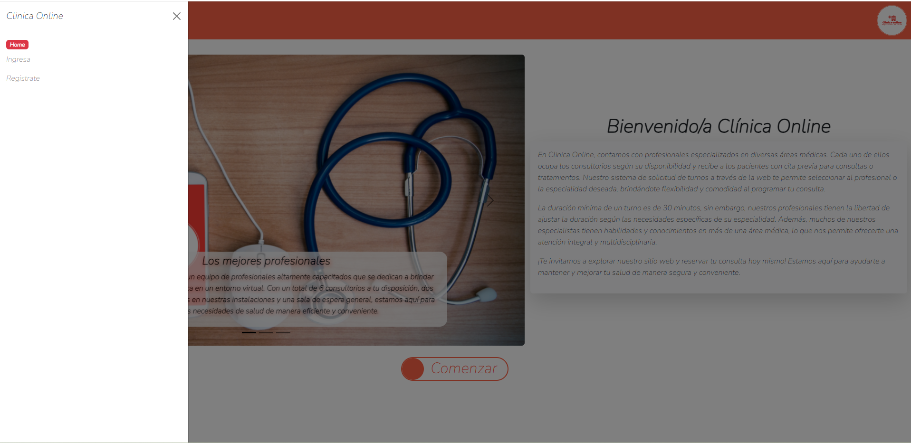
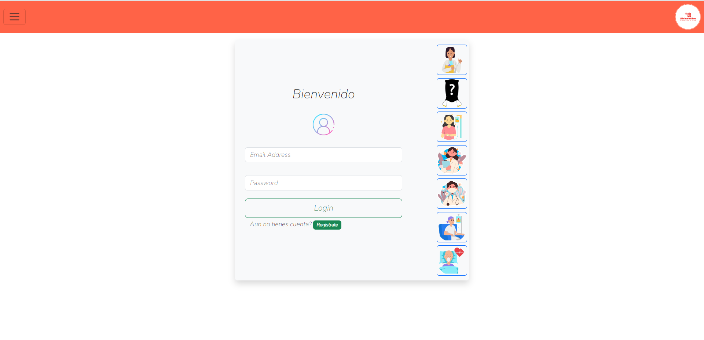
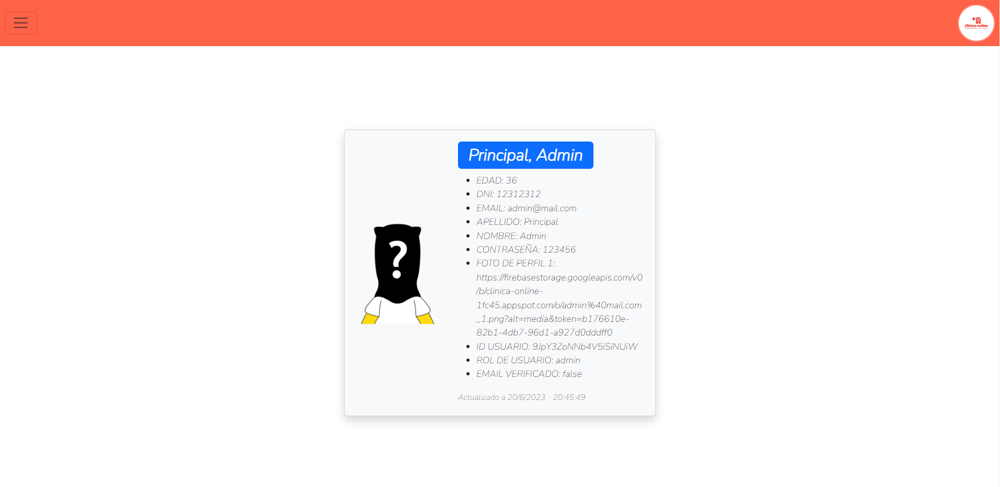

# Clinica Online

Proyecto de Administración de Clínica
Este proyecto tiene como objetivo administrar una clínica, incluyendo la gestión de turnos, médicos, clientes y administradores.

Puede acceder al proyecto a través del siguiente enlace [link](https://clinica-online-1fc45.web.app/).

# Requerimientos de la Aplicación

El sistema que se desarrollará está diseñado para satisfacer las necesidades y deseos del cliente, basado en la siguiente descripción de su negocio:

La Clínica OnLine, especializada en servicios de salud, cuenta actualmente con seis consultorios, dos laboratorios físicos y una sala de espera general. La clínica está abierta al público de lunes a viernes de 8:00 a 19:00, y los sábados de 8:00 a 14:00.

La clínica cuenta con profesionales de diversas especialidades, los cuales utilizan los consultorios según su disponibilidad y atienden a pacientes con turnos asignados para consultas o tratamientos. Los turnos son solicitados a través de la página web, donde los pacientes pueden seleccionar al profesional o la especialidad deseada. La duración mínima de un turno es de 30 minutos, aunque los profesionales tienen la flexibilidad de ajustar la duración según su especialidad. Es importante destacar que un profesional puede tener más de una especialidad.

Además, dentro de la clínica, hay un sector encargado de la organización y administración general de la misma.

¡Bienvenido a nuestro proyecto de administración de clínica! Esperamos que esta aplicación sea de gran utilidad para gestionar eficientemente los turnos, médicos, clientes y administradores de su clínica.

# Detalles de la aplicacion

**Home - Pantalla de Inicio**

_Podemos utilizar la barra de navegación para desplazarnos en las distintas rutas._

_Desde el lateral izquierdo podemos ingresar al login, donde podremos iniciar sesión para poder acceder a las distintas rutas o bien ._

**Login**

_Desde aquí podremos iniciar sesión con nuestro mail y contraseña, ambos datos son requeridos para ingresar correctamente._

_En caso de no contar con una cuenta, desde el botón inferior podremos dirigirnos a la seccion de registro._

**Mi perfil**

_Desde aquí podremos ver todos los datos del usuario que se encuentra en una sesión activa_

_En el caso de los especialistas, estos desde aquí podrán ingresar su horario disponible para los turnos._  

# Como desplegar el proyecto de manera local

This project was generated with [Angular CLI](https://github.com/angular/angular-cli) version 16.0.2.

## Development server

Run `ng serve` for a dev server. Navigate to `http://localhost:4200/`. The application will automatically reload if you change any of the source files.

## Code scaffolding

Run `ng generate component component-name` to generate a new component. You can also use `ng generate directive|pipe|service|class|guard|interface|enum|module`.

## Build

Run `ng build` to build the project. The build artifacts will be stored in the `dist/` directory.

## Running unit tests

Run `ng test` to execute the unit tests via [Karma](https://karma-runner.github.io).

## Running end-to-end tests

Run `ng e2e` to execute the end-to-end tests via a platform of your choice. To use this command, you need to first add a package that implements end-to-end testing capabilities.

## Further help

To get more help on the Angular CLI use `ng help` or go check out the [Angular CLI Overview and Command Reference](https://angular.io/cli) page.
